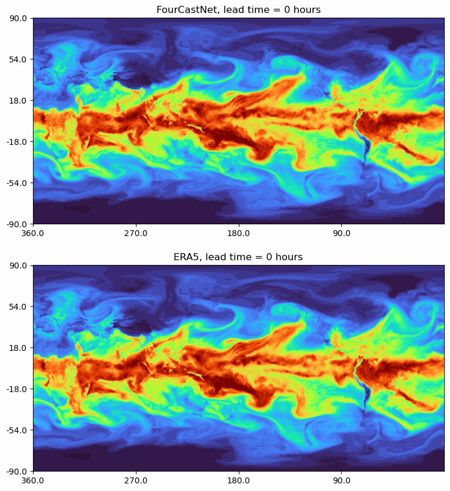

# FourCastNet

 

This repository contains the code used for "FourCastNet: A Global Data-driven High-resolution Weather Model using Adaptive Fourier Neural Operators" \[[paper](https://arxiv.org/abs/2202.11214)\]

The code was developed by the authors of the preprint: 
[Jaideep Pathak](https://research.nvidia.com/person/jaideep-pathak), [Shashank Subramanian](https://www.nersc.gov/about/nersc-staff/nesap-postdocs/shashank-subramanian/), [Peter Harrington](https://www.nersc.gov/about/nersc-staff/data-analytics-services/peter-harrington/), [Sanjeev Raja](https://sanjeevraja.com), [Ashesh Chattopadhyay](https://sites.google.com/view/ashesh6810/home), [Morteza Mardani](https://web.stanford.edu/~morteza/), [Thorsten Kurth](https://github.com/azrael417), [David Hall](https://david-matthew-hall.com), [Zongyi Li](https://zongyi-li.github.io), [Kamyar Azizzadenesheli](https://www.cs.purdue.edu/homes/kamyar/), [Pedram Hassanzadeh](http://pedram.rice.edu/director/), [Karthik Kashinath](https://www.linkedin.com/in/karthik-kashinath), [Animashree Anandkumar](http://tensorlab.cms.caltech.edu/users/anima/)

FourCastNet, short for Fourier Forecasting Neural Network, is a global data-driven weather forecasting model that provides accurate short to medium-range global predictions at 0.25∘ resolution. FourCastNet accurately forecasts high-resolution, fast-timescale variables such as the surface wind speed, precipitation, and atmospheric water vapor. It has important implications for planning wind energy resources, predicting extreme weather events such as tropical cyclones, extra-tropical cyclones, and atmospheric rivers. FourCastNet matches the forecasting accuracy of the ECMWF Integrated Forecasting System (IFS), a state-of-the-art Numerical Weather Prediction (NWP) model, at short lead times for large-scale variables, while outperforming IFS for variables with complex fine-scale structure, including precipitation. FourCastNet generates a week-long forecast in less than 2 seconds, orders of magnitude faster than IFS. The speed of FourCastNet enables the creation of rapid and inexpensive large-ensemble forecasts with thousands of ensemble-members for improving probabilistic forecasting. We discuss how data-driven deep learning models such as FourCastNet are a valuable addition to the meteorology toolkit to aid and augment NWP models.

FourCastNet is based on the vision transformer architecture with Adaptive Fourier Neural Operator (AFNO) attention proposed in Guibas-Mardani et al. \[[paper](https://openreview.net/pdf?id=EXHG-A3jlM)\], \[[code](https://github.com/NVlabs/AFNO-transformer)\].





## Quick Links:

[Pre-processed Training Data - Globus Download Link](https://app.globus.org/file-manager?origin_id=945b3c9e-0f8c-11ed-8daf-9f359c660fbd&origin_path=%2F~%2Fdata%2F)

[Trained Model Weights - Globus Download Link](https://app.globus.org/file-manager?origin_id=945b3c9e-0f8c-11ed-8daf-9f359c660fbd&origin_path=%2F~%2Fmodel_weights%2F)

[Trained Model Weights - Web Download Link](https://portal.nersc.gov/project/m4134/FCN_weights_v0/)


## Version Notes:

| Release Version      | Model Weights | Training Data   | Normalization |
|----------------------|---------------|-----------------|--------------|
| Initial release v0.0.0 | [FCN_weights_v0](https://app.globus.org/file-manager?origin_id=945b3c9e-0f8c-11ed-8daf-9f359c660fbd&origin_path=%2F~%2Fmodel_weights%2F)| [FCN_ERA5_data_v0](https://app.globus.org/file-manager?origin_id=945b3c9e-0f8c-11ed-8daf-9f359c660fbd&origin_path=%2F~%2Fdata%2F)| [stats_v0](https://app.globus.org/file-manager?origin_id=945b3c9e-0f8c-11ed-8daf-9f359c660fbd&origin_path=%2F~%2Fadditional%2F)     |

## Training:

The model is trained on a subset of ERA5 reanalysis data on single levels \[ [Hersbach 2018](10.24381/cds.adbb2d47) \] and pressure levels \[ [Hersbach 2018](10.24381/cds.bd0915c6) \]  that is pre-processed and stored into hdf5 files. 

The subset of the ERA5 training data that FCN was trained on is hosted at the National Energy Resarch Scientific Computing Center (NERSC). For convenience it is available to all via Globus at the following link. 

[Pre-processed Training Data](https://app.globus.org/file-manager?origin_id=945b3c9e-0f8c-11ed-8daf-9f359c660fbd&origin_path=%2F~%2Fdata%2F)

You will need a Globus account and will need to be logged in to your account in order to access the data. The full dataset that this version of FourCastNet was trained on is approximately 5TB in size.

The data directory is organized as follows:

```
FCN_ERA5_data_v0
│   README.md
└───train
│   │   1979.h5
│   │   1980.h5
│   │   ...
│   │   ...
│   │   2015.h5
│   
└───test
│   │   2016.h5
│   │   2017.h5
│
└───out_of_sample
│   │   2018.h5
│
└───static
│   │   orography.h5
│
└───precip
│   │   train/
│   │   test/
│   │   out_of_sample/

```

Precomputed stats are provided at [additional](https://app.globus.org/file-manager?origin_id=945b3c9e-0f8c-11ed-8daf-9f359c660fbd&origin_path=%2F~%2Fadditional%2F) and have the directory structure:
```
stats_v0
│   global_means.npy  
│   global_stds.npy  
│   land_sea_mask.npy  
│   latitude.npy  
│   longitude.npy  
│   time_means.npy
│   time_means_daily.h5
└───precip
│   │   time_means.npy

```

Training configurations can be set up in [config/AFNO.yaml](config/AFNO.yaml). The following paths need to be set by the user. These paths should point to the data and stats you downloaded in the steps above:

```
afno_backbone: &backbone
  <<: *FULL_FIELD
  ...
  ...
  orography: !!bool False 
  orography_path: None # provide path to orography.h5 file if set to true, 
  exp_dir:             # directory path to store training checkpoints and other output
  train_data_path:     # full path to /train/
  valid_data_path:     # full path to /test/
  inf_data_path:       # full path to /out_of_sample. Will not be used while training.
  time_means_path:     # full path to time_means.npy
  global_means_path:   # full path to global_means.npy
  global_stds_path:    # full path to global_stds.npy

```

An example launch script for distributed data parallel training on the slurm based HPC cluster perlmutter is provided in ```submit_batch.sh```. Please follow the pre-training and fine-tuning procedures as described in the pre-print.

To run the precipitation diagnostic model, see the following example config:

```
precip: &precip
  <<: *backbone
  ...
  ...
  precip:              # full path to precipitation data files 
  time_means_path_tp:  # full path to time means for precipitation
  model_wind_path:     # full path to backbone model weights ckpt

```


## Inference:
In order to run FourCastNet in inference mode you will need to have the following files on hand.

1. The path to the out of training sample hdf5 file. This could either be a new set of initial conditions that you downloaded from copernicus and processed yourself (see separate instructions for doing so in the next section), or it could be out_of_sample dataset hosted [here](https://app.globus.org/file-manager?origin_id=945b3c9e-0f8c-11ed-8daf-9f359c660fbd&origin_path=%2F~%2Fdata%2F). The inference script provided assumes that you are using the ```out_of_sample/2018.h5``` file. You can modify the script to use a different h5 file that you processed yourself after downloading the raw data from Copernicus.
2. The model weights hosted at [Trained Model Weights](https://app.globus.org/file-manager?origin_id=945b3c9e-0f8c-11ed-8daf-9f359c660fbd&origin_path=%2F~%2Fmodel_weights%2F)
```
FCN_weights_v0/
│   backbone.ckpt  
│   precip.ckpt  
```
3. The pre-computed normalization statistics hosted at [additional](https://app.globus.org/file-manager?origin_id=945b3c9e-0f8c-11ed-8daf-9f359c660fbd&origin_path=%2F~%2Fadditional%2F). It is crucial that you use the statistics that are provided if you are using the pre-trained model weights that we have provided since these stats were used when trainig the model. The normalization statistics go hand-in-hand with the trained model weights. The stats folder contains:
```
stats_v0
│   global_means.npy  
│   global_stds.npy  
│   land_sea_mask.npy  
│   latitude.npy  
│   longitude.npy  
│   time_means.npy
│   time_means_daily.h5
```

Once you have all the file listed above you should be ready to go.

In [config/AFNO.yaml](config/AFNO.yaml), set the user defined paths

```
afno_backbone: &backbone
  <<: *FULL_FIELD
  ...
  ...
  orography: !!bool False 
  orography_path: None # provide path to orography.h5 file if set to true, 
  inf_data_path:       # full path to /out_of_sample. Will not be used while training.
  time_means_path:     # full path to time_means.npy
  global_means_path:   # full path to global_means.npy
  global_stds_path:    # full path to global_stds.npy

```


Run inference using

```
python inference/inference.py \
       --config=afno_backbone \
       --run_num=0 \
       --weights '/path/to/weights/backbone.ckpt' \
       --override_dir '/path/to/output/scratch/directory/ \' 
```

Run inference for precipitation using

```
python inference/inference_precip.py \
       --config=precip \
       --run_num=0 \
       --weights '/path/to/weights/precip.ckpt' \
       --override_dir '/path/to/output/scratch/directory/ \' 
```

Additional information on batched ensemble inference and precipitation model inference can be found at [inference/README_inference.md](inference/README_inference.md)

The outputs of the inference scripts will be written to an hdf5 file at the path specified in the ```--override_dir``` input argument. Depending on the params set in the config file, the output file will contain the computed ACC and RMSE of the forecasts and the raw forecasts of selected fields for visualization.

## Inference for a custom interval

The steps will walk you through:
1. Downloading an initial condition from the (continuously expanding) ERA5 dataset to initialize a FourCastNet model.
2. Pre-processing the downloaded ERA5 files
3. Running inference

#### Downloading an initial condition to initialize FourCastNet.

If you are interested in generating a forecast using FourCastNet for a specific time-interval, you should begin by downloading the ERA5 netCDF files for the relevant variables from the Copernicus Climate Change Service Data Store. For convenience, the scripts are provided in [/copernicus](/copernicus). Specifically, you need the two scripts [/copernicus/get_data_pl_short_length.py](/copernicus/get_data_pl_short_length.py) and [/copernicus/get_data_sl_short_length.py](/copernicus/get_data_sl_short_length.py). These two scripts will respectively download (a superset of) the atmospheric variables on single levels and pressure levels that are modelled by FourCastNet. Be sure to specify the correct time interval in both scripts. While a single temporal snapshot from ERA5 is sufficient to generate a forecast using FourCastNet, you will want to download the ground truth for the full interval you are interested in. This is so that you can analyze the skill of FourCastNet by comparing with the ERA5 ground truth via the RMSE and ACC metrics.

The example scripts show you how to download pl and sl variables in an interval from 19 October 2021 to 31 October 2021. Be sure to download consecutive days only and keep all snapshots at the 0, 6, 12, 18 hour timestamps.

#### Pre-processing

Once you have downloaded the relevant netCDF4 files, you will also need to pre-process them. The pre-processing step simply copies the variables into hdf5 files in the correct order that the trained FourCastNet model expects as input. The pre-processing can be performed using the script [data_process/parallel_copy_small_set.py](data_process/parallel_copy_small_set.py). While the script is MPI capable in order to deal with long time intervals, if your desired interval is short (say a few weeks), you can run it on a single process.

The example script shows you how to process pl and sl variables in the time interval from 19 October 2021 to 31 October 2021 that we downloaded in the previous step.

#### Running inference

Follow the general steps listed in the Inference section above. You will need to make appropriate modifications to the [inference/inference.py](inference/inference.py) script.


## References:

ERA5 data \[ Hersbach, H. et al., (2018) \] was downloaded from the Copernicus Climate Change Service (C3S) Climate Data Store.

```
Hersbach, H., Bell, B., Berrisford, P., Biavati, G., Horányi, A., Muñoz Sabater, J., Nicolas, J., Peubey, C., Radu, R., Rozum, I., Schepers, D., Simmons, A., Soci, C., Dee, D., Thépaut, J-N. (2018): ERA5 hourly data on pressure levels from 1959 to present. Copernicus Climate Change Service (C3S) Climate Data Store (CDS). , 10.24381/cds.bd0915c6

Hersbach, H., Bell, B., Berrisford, P., Biavati, G., Horányi, A., Muñoz Sabater, J., Nicolas, J., Peubey, C., Radu, R., Rozum, I., Schepers, D., Simmons, A., Soci, C., Dee, D., Thépaut, J-N. (2018): ERA5 hourly data on single levels from 1959 to present. Copernicus Climate Change Service (C3S) Climate Data Store (CDS). , 10.24381/cds.adbb2d47
```

If you find this work useful, cite it using:
```
@article{pathak2022fourcastnet,
  title={Fourcastnet: A global data-driven high-resolution weather model using adaptive fourier neural operators},
  author={Pathak, Jaideep and Subramanian, Shashank and Harrington, Peter and Raja, Sanjeev and Chattopadhyay, Ashesh and Mardani, Morteza and Kurth, Thorsten and Hall, David and Li, Zongyi and Azizzadenesheli, Kamyar and Hassanzadeh, Pedram and Kashinath, Karthik and Anandkumar, Animashree},
  journal={arXiv preprint arXiv:2202.11214},
  year={2022}
}
```


